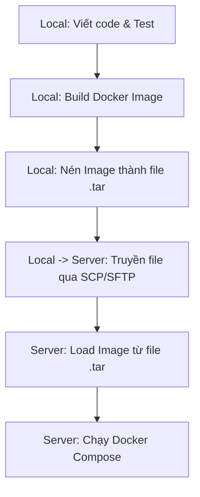

# Hướng dẫn Triển khai Thủ công qua Docker Image (.tar) cho Môi trường Nghiêm ngặt

Tài liệu này hướng dẫn cách triển khai ứng dụng lên server Production bằng phương pháp đóng gói Docker Image thành file nén `.tar` từ máy local, chuyển file qua mạng (SCP/SFTP) lên server và chạy. 

Quy trình này đảm bảo **không để lộ mã nguồn (Source Code)** trên server Production và **không cần sử dụng internet hay Docker Hub** (phù hợp với môi trường bảo mật nghiêm ngặt).

---

## Sơ đồ Quy trình triển khai



---

## Các yêu cầu chuẩn bị
1. **Máy Local:** Đã cài đặt Docker Desktop.
2. **Server Production:**
   * Đã cài đặt Docker và Docker Compose (hoặc Portainer).
   * Cho phép kết nối từ xa qua SSH (cổng 22) và có tài khoản để đăng nhập.
3. **Mạng kết nối:** Máy local có thể ping được IP của Server Production.

---

## Các bước thực hiện chi tiết

### Bước 1: Build Docker Image ở máy Local
Mở Terminal (PowerShell hoặc Command Prompt) tại thư mục gốc của dự án trên máy local và chạy lệnh build Docker image:

```bash
docker build -t buildcacheredisprojectmini:latest .
```

*Lưu ý: Dấu chấm `.` ở cuối lệnh chỉ định build tại thư mục hiện tại.*

---

### Bước 2: Nén Docker Image thành file `.tar`
Sau khi build xong, nén image vừa tạo thành một file nén vật lý để chuẩn bị di chuyển:

```bash
docker save -o buildcacheredisprojectmini.tar buildcacheredisprojectmini:latest
```

Sau khi chạy xong lệnh này, bạn sẽ thấy file `buildcacheredisprojectmini.tar` xuất hiện trong thư mục dự án của bạn ở máy local.

---

### Bước 3: Copy file `.tar` và file `docker-compose.yml` lên Server
Chúng ta sẽ truyền hai file này lên Server qua giao thức mạng an toàn. Bạn có hai cách thực hiện:

#### Cách A: Sử dụng dòng lệnh (Khuyên dùng)
Sử dụng lệnh `scp` (Secure Copy Protocol) có sẵn trên PowerShell của Windows:

```powershell
# Cú pháp: scp <tên_file> <username>@<ip_server>:<thư_mục_trên_server>

# 1. Tạo thư mục chứa dự án trên Server (nếu chưa có)
ssh user@192.168.1.100 "mkdir -p /app/redis-cache-project"

# 2. Copy file Image .tar lên Server
scp buildcacheredisprojectmini.tar user@192.168.1.100:/app/redis-cache-project/

# 3. Copy file docker-compose.yml lên Server
scp docker-compose.yml user@192.168.1.100:/app/redis-cache-project/
```
*(Thay thế `user` bằng tài khoản của server và `192.168.1.100` bằng IP thực tế của Server).*

#### Cách B: Sử dụng phần mềm giao diện (GUI)
Nếu không quen dùng lệnh, bạn có thể tải các phần mềm truyền file miễn phí như **WinSCP** hoặc **FileZilla**:
1. Đăng nhập vào Server qua SFTP (dùng IP, Port 22, Username/Password).
2. Tạo thư mục `/app/redis-cache-project` trên Server.
3. Kéo thả file `buildcacheredisprojectmini.tar` và `docker-compose.yml` từ máy local sang thư mục đó trên Server.

---

### Bước 4: Nạp (Load) Image vào Docker trên Server
1. Kết nối SSH vào Server:
   ```bash
   ssh user@192.168.1.100
   ```
2. Di chuyển tới thư mục chứa dự án:
   ```bash
   cd /app/redis-cache-project
   ```
3. Chạy lệnh nạp ảnh từ file `.tar` vào Docker của Server:
   ```bash
   docker load -i buildcacheredisprojectmini.tar
   ```
   *Sau khi lệnh hoàn thành, bạn chạy lệnh `docker images` trên server để kiểm tra. Bạn sẽ thấy image `buildcacheredisprojectmini:latest` xuất hiện trong danh sách.*
```*D:\9. BuildImageSourcceToDocker>docker load -i buildcacheredisprojectmini.tar
```*Loaded image: buildcacheredisprojectmini:latest

```*D:\9. BuildImageSourcceToDocker>
---

### Bước 5: Chỉnh sửa cấu hình và chạy ứng dụng trên Server

Trước khi chạy, bạn cần cập nhật file `docker-compose.yml` trên Server để đảm bảo nó sử dụng trực tiếp Image đã load thay vì tìm thư mục mã nguồn để build.

Mở file `docker-compose.yml` trên Server (ví dụ dùng lệnh `nano docker-compose.yml` hoặc chỉnh sửa qua WinSCP) và thay đổi cấu hình service `web-api` như sau:

#### So sánh cấu hình Local vs Production:

**Tại Local (Cần build từ source):**
```yaml
  web-api:
    image: buildcacheredisprojectmini:latest
    build:
      context: .
      dockerfile: Dockerfile
    container_name: web-api
    ...
```

**Tại Server Production (Chỉ dùng Image đã load, xóa bỏ block `build`):**
```yaml
  web-api:
    image: buildcacheredisprojectmini:latest
    # BỎ HOÀN TOÀN block build:
    # build:
    #   context: .
    #   dockerfile: Dockerfile
    container_name: web-api
    ports:
      - "8080:8080"
    environment:
      - ASPNETCORE_ENVIRONMENT=Production  # Chuyển sang Production
      - Redis__ConnectionString=redis-cache:6379
    depends_on:
      - redis-cache
    restart: always
```

#### Tiến hành chạy hệ thống:
Tại thư mục chứa dự án trên Server, gõ lệnh sau để khởi chạy toàn bộ các dịch vụ (Redis, Web API, Portainer):

```bash
docker compose down      # Tắt các container cũ nếu có
docker compose up -d     # Khởi chạy ngầm các container mới
```

---

## Kiểm tra trạng thái hệ thống trên Server

1. **Xem danh sách container đang chạy:**
   ```bash
   docker ps
   ```
   *Yêu cầu: Cả 3 container (`web-api`, `redis-cache`, `portainer`) phải ở trạng thái `Up`.*

2. **Xem logs ghi nhận của API (Bao gồm log Request của Serilog):**
   ```bash
   docker compose logs -f web-api
   ```

3. **Kiểm tra sức khỏe của API (Health check):**
   Chạy lệnh curl ngay trên server để kiểm tra xem Web API và Redis có hoạt động ổn định không:
   ```bash
   curl http://localhost:8080/health
   ```
   *Yêu cầu kết quả trả về:* `Healthy`

---

## Dọn dẹp dung lượng (Khuyên dùng)
Sau khi load thành công Image vào Docker, file `.tar` ban đầu trên Server không còn cần thiết nữa. Bạn có thể xóa đi để tiết kiệm bộ nhớ cho máy chủ:
```bash
rm buildcacheredisprojectmini.tar
```
